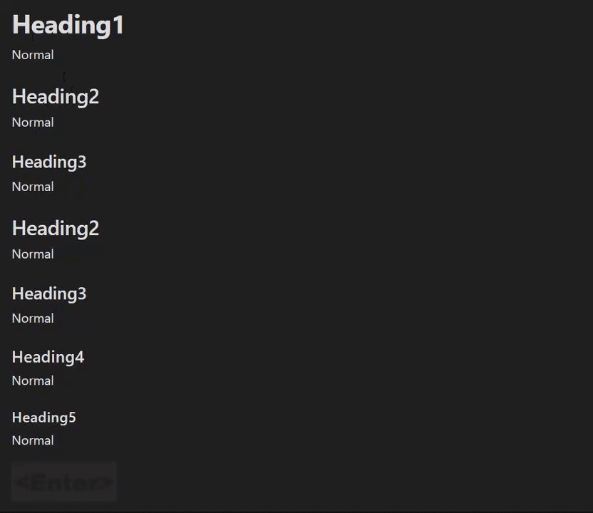

# Obsidian Heading Shifter

Easily Shift and Change markdown headings.

## Demo

## How to install

### From within Obsidian

You can activate this plugin within Obsidian by doing the following:

-   Open Settings > Community plugin
-   Make sure `Restricted mode` is off
-   Click Browse `community plugins`
-   Search for `Heading Shifter`
-   Click `Install` -> `Enable`

### Manual installation

Download directory(includes `main.js, manifest.json, styles.css`) from the latest release and put them into `<vault>/.obsidian/plugins/` folder.

## Features

### Applying Heading

#### Commands

\*All commands work when only one line is selected.

| Command           | Description                         | Hotkey |
| ----------------- | ----------------------------------- | ------ |
| Apply Heading 0   | Change Current line to no heading.  | -      |
| Apply Heading 1~5 | Change Current line to heading 1~5. | -      |

> It is useful to assign a hotkey such as `Ctrl + 0 ~ 5`

### Headings Shift

#### Settings

| Setting                | Description                                                        | Value |
| ---------------------- | ------------------------------------------------------------------ | ----- |
| Lower limit of Heading | The lower Heading Size that will be decreased by the Heading Shift | 0~5   |

#### Commands

| Command           | Description                                      | Hotkey |
| ----------------- | ------------------------------------------------ | ------ |
| Increase Headings | Increase heading of selected lines(with heading) |        |
| Decrease Headings | Decrease heading of selected lines(with heading) |        |

> It is useful to assign a hotkey such as `Ctrl + Shift + Left/Right`

-   `Increase Headings` is ineffective if selected lines contains less than `Lower limit of Heading`.
-   `Decrease Headings` is ineffective if selected lines contains more than heading 5.

## Loadmap

Nothing specific at this time.

## Contribute

Feel free to report issues or request features.
